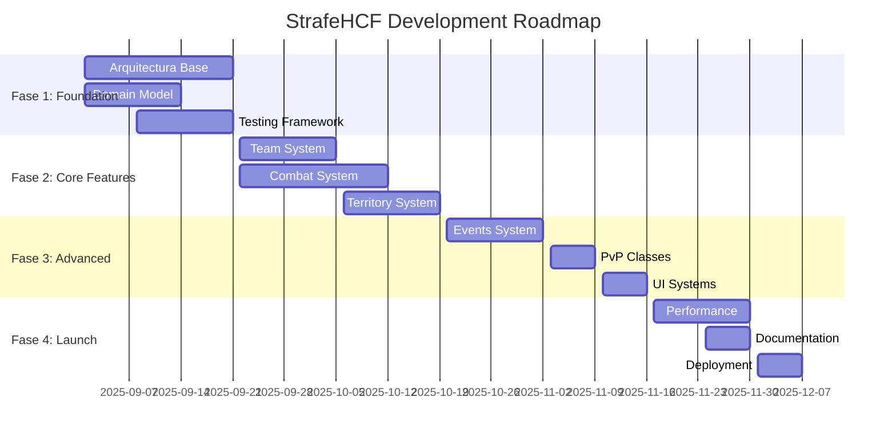

# 🗡️ StrafeHCF

<div align="center">


**Plugin HCF moderno y optimizado para Minecraft 1.21.8**

*Desarrollado específicamente para el servidor StrafePVP*

</div>

---

## 📋 Tabla de Contenidos

- [🎯 Descripción del Proyecto](#-descripción-del-proyecto)
- [✨ Características Principales](#-características-principales)
- [🏗️ Arquitectura](#️-arquitectura)
- [📊 Estado del Proyecto](#-estado-del-proyecto)
- [🚀 Roadmap](#-roadmap)
- [📚 Documentación](#-documentación)
- [🛠️ Stack Tecnológico](#️-stack-tecnológico)
- [👥 Equipo](#-equipo)
- [📈 Métricas del Proyecto](#-métricas-del-proyecto)

## 🎯 Descripción del Proyecto

**StrafeHCF** es un plugin HCF (Hardcore Factions) completamente nuevo desarrollado desde cero para Minecraft 1.21.8. Basado en el análisis exhaustivo de **GelicHCF**, este proyecto implementa una arquitectura moderna, código limpio y las mejores prácticas de desarrollo.

### 🎮 ¿Qué es HCF?

HCF (Hardcore Factions) es una modalidad de Minecraft PvP que combina:
- **Sistema de Facciones**: Equipos de hasta 15 jugadores
- **Claiming Territorial**: Reclamar y proteger territorio
- **DTR System**: Deaths Till Raidable (muertes hasta ser raideado)
- **Deathban**: Baneo temporal al morir
- **Eventos Competitivos**: KOTH, Citadel, y más

### 🌟 ¿Por qué un nuevo plugin?

- **Arquitectura Moderna**: Hexagonal architecture con SOLID principles
- **Performance Optimizado**: Para 500+ jugadores concurrentes
- **Código Limpio**: 85%+ test coverage, documentación completa
- **Minecraft 1.21.8**: Aprovecha las últimas características
- **Mantenibilidad**: Diseñado para evolución a largo plazo

## ✨ Características Principales

### 🏰 Core Features (MVP)
- ✅ **Sistema de Equipos** - Creación, gestión y roles
- ✅ **Sistema DTR** - Deaths Till Raidable con regeneración
- ✅ **Deathban** - Muerte temporal con arena de PvP
- ✅ **Combat System** - Combat tag, cooldowns, timers
- ✅ **Territory Claiming** - Sistema de claims con protección
- ✅ **KOTH Events** - King of the Hill competitivo

### ⚔️ Combat & PvP
- **PvP Classes**: Diamond, Archer, Bard
- **Combat Tag**: 45 segundos sin logout
- **Item Cooldowns**: Pearls (16s), Gapples (45s), Enchanted Gapples (3h)
- **Strength Nerf**: Balanceado para gameplay justo
- **PvP Protection**: Timer para nuevos jugadores

### 🎯 Eventos y Actividades
- **KOTH**: King of the Hill con rewards automáticos
- **Citadel**: Eventos semanales de gran escala
- **EOTW**: End of the World para final de mapa
- **SOTW**: Start of the World para inicios de mapa

### 🔧 Herramientas de Staff
- **Staff Mode**: Vanish, inspection, freeze
- **Moderation**: Sistema de reportes y requests
- **Analytics**: Métricas y estadísticas detalladas
- **Restore System**: Backup y restauración de inventarios

## 🏗️ Arquitectura

### 📐 Hexagonal Architecture

```
┌─────────────────────────────────────────────────────────────────┐
│                        🎮 Adapters (UI)                        │
│  Spigot Commands │ REST API │ Discord Bot │ Web Interface      │
└─────────────────────────┬───────────────────────────────────────┘
                          │
┌─────────────────────────┴───────────────────────────────────────┐
│                    🎯 Application Layer                        │
│     Use Cases │ Commands │ Queries │ Event Handlers           │
└─────────────────────────┬───────────────────────────────────────┘
                          │
┌─────────────────────────┴───────────────────────────────────────┐
│                     🏛️ Domain Layer                            │
│  Entities │ Value Objects │ Domain Services │ Business Rules   │
└─────────────────────────┬───────────────────────────────────────┘
                          │
┌─────────────────────────┴───────────────────────────────────────┐
│                   💾 Infrastructure (Adapters)                 │
│  PostgreSQL │ Redis │ File System │ External APIs             │
└─────────────────────────────────────────────────────────────────┘
```

### 🎨 Principios de Diseño
- **SOLID Principles**: Single Responsibility, Open/Closed, etc.
- **Domain-Driven Design**: Lógica de negocio en el dominio
- **CQRS**: Separación de commands y queries
- **Event-Driven**: Comunicación desacoplada via eventos
- **Clean Architecture**: Dependencias hacia adentro

## 📊 Estado del Proyecto

### 🚦 Fase Actual: **Planificación y Análisis** (Completada)

| Fase | Estado | Duración | Descripción |
|------|--------|----------|-------------|
| 📋 **Análisis** | ✅ Completada | 1 semana | Análisis de GelicHCF y planificación |
| 🏗️ **Foundation** | 🔄 En progreso | 3 semanas | Arquitectura base y domain model |
| ⚔️ **Core Features** | 📅 Planificada | 3 semanas | MVP con features principales |
| 🎯 **Advanced Features** | 📅 Planificada | 3 semanas | Features avanzados y polish |
| 🚀 **Launch Ready** | 📅 Planificada | 2 semanas | Optimización y deployment |

### 📈 Progreso Actual

```
Análisis y Documentación  ████████████████████████████████ 100%
Arquitectura Base          ████████░░░░░░░░░░░░░░░░░░░░░░░░  25%
Core Features              ░░░░░░░░░░░░░░░░░░░░░░░░░░░░░░░░   0%
Advanced Features          ░░░░░░░░░░░░░░░░░░░░░░░░░░░░░░░░   0%
Production Ready           ░░░░░░░░░░░░░░░░░░░░░░░░░░░░░░░░   0%
```

## 🚀 Roadmap

### 📅 Timeline (12 semanas)



### 🎯 Milestones Principales

- **📅 Semana 6**: MVP completado (Alpha testing)
- **📅 Semana 9**: Feature complete (Beta testing)
- **📅 Semana 12**: Production ready (Live deployment)

## 📚 Documentación

La documentación completa está disponible en la carpeta [`/docs`](./docs/):

| Documento | Descripción |
|-----------|-------------|
| [📋 README](./docs/README.md) | Introducción y overview |
| [🏗️ Análisis de Arquitectura](./docs/analisis-arquitectura.md) | Análisis de GelicHCF |
| [✨ Análisis de Características](./docs/analisis-caracteristicas.md) | 150+ features identificadas |
| [🔧 Análisis Técnico](./docs/analisis-tecnico.md) | Stack y dependencias |
| [📋 Requerimientos Funcionales](./docs/requerimientos-funcionales.md) | Features priorizados |
| [🏛️ Arquitectura Propuesta](./docs/arquitectura-propuesta.md) | Diseño técnico |
| [🗓️ Roadmap de Desarrollo](./docs/roadmap-desarrollo.md) | Plan de 12 semanas |
| [⚖️ Comparativa de Features](./docs/comparativa-features.md) | Qué mantener/mejorar |
| [⚙️ Configuraciones HCF](./docs/configuraciones-hcf.md) | Configs del gamemode |
| [📖 Patrones y Best Practices](./docs/patrones-bestpractices.md) | Guías de desarrollo |

## 🛠️ Stack Tecnológico

### 💻 Core Technologies

| Tecnología | Versión | Propósito |
|------------|---------|-----------|
| **Java** | 21 LTS | Lenguaje principal |
| **Spring Boot** | 3.2+ | Framework de aplicación |
| **Spigot API** | 1.21.8 | Integración con Minecraft |
| **PostgreSQL** | 15+ | Base de datos principal |
| **Redis** | 7+ | Cache y sesiones |
| **Maven** | 3.9+ | Build tool |

### 🧪 Development & Quality

| Herramienta | Propósito |
|-------------|-----------|
| **JUnit 5** | Testing framework |
| **Testcontainers** | Integration testing |
| **SonarQube** | Code quality |
| **Spotbugs** | Static analysis |
| **Jacoco** | Code coverage |
| **GitHub Actions** | CI/CD pipeline |

### 🔧 Tools & Integrations

| Herramienta | Propósito |
|-------------|-----------|
| **Discord API** | Integración con Discord |
| **PlaceholderAPI** | Placeholders estándar |
| **Vault API** | Economía |
| **Micrometer** | Métricas |
| **Logback** | Logging |

## 👥 Equipo

### 👨‍💻 Desarrollo
- **Lead Developer**: Maykol ([@mayk0l](https://github.com/mayk0l))
- **Project Owner**: StrafePVP Team

### 🎯 Stakeholders
- **Servidor**: StrafePVP
- **Modalidad**: HCF (Hardcore Factions)
- **Target**: 500+ jugadores concurrentes

## 📈 Métricas del Proyecto

### 📊 Análisis Base (GelicHCF)
- **Líneas de Código**: ~50,000 LOC analizadas
- **Módulos**: 30+ componentes identificados
- **Features**: 150+ características catalogadas
- **Complejidad**: Alta (7/10 complexity score)

### 🎯 Objetivos StrafeHCF
- **Code Coverage**: >85%
- **Response Time**: <50ms promedio
- **Uptime**: >99.9%
- **Memory Usage**: <2GB para 1000 jugadores
- **TPS**: >19.0 bajo carga normal

### 💾 Comparativa de Features

```
GelicHCF Features Analizadas:     85 features
StrafeHCF Features Planificadas:  55 features (64.7%)

Distribución:
✅ Mantener (as-is):      32 features (37.6%)
🔄 Mejorar:              23 features (27.1%)
❌ Descartar:            28 features (32.9%)
🤔 Evaluar más tarde:     2 features (2.4%)

Reducción de Complejidad: 25%
```

---

## 🤝 Contribución

Este es un proyecto privado para StrafePVP. Si eres parte del equipo:

1. **Clone el repositorio**:
   ```bash
   git clone https://github.com/StrafePVP/StrafeHCF.git
   cd StrafeHCF
   ```

2. **Lee la documentación**: Especialmente [Best Practices](./docs/patrones-bestpractices.md)

3. **Setup del entorno**: Sigue la [guía de setup](./docs/setup-development.md)

4. **Contacta al lead**: Para acceso y onboarding

## 📝 Licencia

Este proyecto es **privado** y propietario de **StrafePVP**. Todos los derechos reservados.

---

<div align="center">

**🎮 Desarrollado con ❤️ para la comunidad HCF de StrafePVP**

*Última actualización: 28 de Agosto, 2025*

</div>
